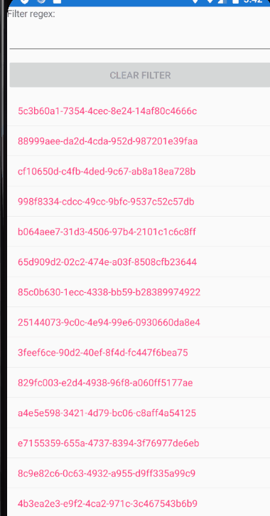

# Responsive Gui
This project acts as a starting point to implement your own Gui.
It has a starter template and a model script to use for getting entries.
Here is an example of how it should behave. It can look however you like.

# Requirements
You need to implement a simple Gui that does the following.
First, it should have a list of entries. This list is composed of `Guid` entries (effectively unique strings) that can only be retrieved via `ResponsiveGui.Models.EntryManager.GetEntries`.
Second, the Gui should have a Filter option. This should be a text entry field which takes a regular expression string. The Guid entries should be filtered according to this filter. No text means 'show all'.
Third, there should be a 'clear filter' button which clears the filter.
Fourth, the entries in the list should be sorted alphanumerically at all times.
The specific theme and layout of the Gui isn't important, so keep it simple and functional.

However, there is one additional requirement which is critical above all else:
The Gui should remain completely responsive at all points. This means no lockup, entries should populate as they are ready. To enforce this, the `ResponsiveGui.Models.EntryManager.GetEntries` enumerator will produce hundreds of thousands of entries, and they will be produced slowly.
When the filter text is changed, entries should come up as they are ready, instead of waiting for the filter to 'apply' on the entire set of entries.

To make things even more complicated, there are a few more requirements with the filter:
First, the filter should be throttled to half a second. This means that as the user enters text, the filter shouldn't 'run' until there's been a break of half a second where the user hasn't changed the text.
Second, Invalid regex filters should be handled in some way
Third, if the filter changes then the 'old' filter should be stopped, the entries cleared, and the new filter results shown.

## How to get started
Fork this repository and make your own branch. It is using a Xamarin form so you can either have it run on an Android virtual device or get it running on another platform. Desktop and web are good ideas.

## Hints
Here are some links to help you get started:

- https://docs.microsoft.com/en-us/archive/msdn-magazine/2019/november/csharp-iterating-with-async-enumerables-in-csharp-8
- https://docs.microsoft.com/en-us/xamarin/xamarin-forms/xaml/xaml-basics/data-bindings-to-mvvm
- https://docs.microsoft.com/en-us/dotnet/api/system.threading.cancellationtoken?view=net-6.0
- https://docs.microsoft.com/en-us/dotnet/api/system.threading.semaphore?view=net-6.0
- https://docs.microsoft.com/en-us/xamarin/xamarin-forms/user-interface/listview/performance
